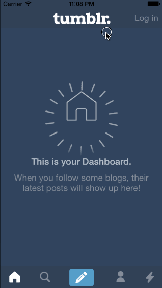

TumblrPrototype
============

This is an iOS prototype of the Tumblr app's custom navigation.

Time spent: 5 hours spent in total

Completed user stories:

* &#10004; Tapping on Home, Search, Account, or Trending should show the respective screen and highlight the tab bar button.
* &#10004; Compose button should modally present the compose screen.

Walkthrough of all user stories:

GIF created with [LiceCap](http://www.cockos.com/licecap/).
